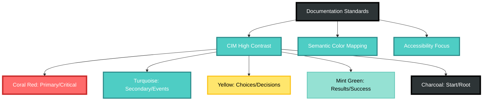

# Contributing to CIM Domain Workflow

Thank you for your interest in contributing to the CIM Domain Workflow module! This document provides guidelines and instructions for contributing.

## Code of Conduct

By participating in this project, you agree to abide by our Code of Conduct:

- **Be respectful** - Treat all contributors with respect
- **Be collaborative** - Work together to solve problems
- **Be inclusive** - Welcome contributors of all backgrounds
- **Be professional** - Keep discussions focused on the code

## Getting Started

1. **Fork the repository** on GitHub
2. **Clone your fork** locally:
   ```bash
   git clone https://github.com/YOUR_USERNAME/cim-domain-workflow.git
   cd cim-domain-workflow
   ```
3. **Add upstream remote**:
   ```bash
   git remote add upstream https://github.com/thecowboyai/cim-domain-workflow.git
   ```
4. **Create a feature branch**:
   ```bash
   git checkout -b feature/your-feature-name
   ```

## Development Process

### 1. Follow CIM Principles

This module is part of the Composable Information Machine ecosystem. All contributions must:

- **Use Event-Driven Architecture** - No CRUD operations
- **Follow Domain-Driven Design** - Respect domain boundaries
- **Implement Event Sourcing** - All state changes through events
- **Practice Test-Driven Development** - Write tests first
- **Track Progress** - Update progress.json for significant changes

### 2. Development Workflow

1. **Write tests first** (TDD is mandatory)
2. **Implement the feature**
3. **Ensure all tests pass**:
   ```bash
   cargo test
   ```
4. **Check code formatting**:
   ```bash
   cargo fmt --check
   cargo clippy -- -D warnings
   ```
5. **Update documentation** if needed
6. **Add examples** for new features

### 3. Commit Guidelines

Follow conventional commit format:

```
type(scope): description

[optional body]

[optional footer]
```

Types:
- `feat`: New feature
- `fix`: Bug fix
- `docs`: Documentation changes
- `test`: Test additions/changes
- `refactor`: Code refactoring
- `style`: Formatting changes
- `chore`: Maintenance tasks

Examples:
```
feat(workflow): add timeout handling for steps
fix(state-machine): correct transition validation
docs(readme): update installation instructions
test(cross-domain): add integration tests
```

### 4. Pull Request Process

1. **Update your branch**:
   ```bash
   git fetch upstream
   git rebase upstream/main
   ```

2. **Run all checks**:
   ```bash
   cargo test
   cargo fmt
   cargo clippy -- -D warnings
   cargo doc --no-deps
   ```

3. **Create pull request**:
   - Use a descriptive title
   - Reference any related issues
   - Describe what changes were made and why
   - Include test results

4. **PR Template**:
   ```markdown
   ## Description
   Brief description of changes

   ## Type of Change
   - [ ] Bug fix
   - [ ] New feature
   - [ ] Breaking change
   - [ ] Documentation update

   ## Testing
   - [ ] All tests pass
   - [ ] Added new tests
   - [ ] Updated existing tests

   ## Checklist
   - [ ] Follows CIM principles
   - [ ] Code is formatted
   - [ ] Documentation updated
   - [ ] Examples added/updated
   ```

## Testing Requirements

### Test Coverage

- Maintain minimum 90% test coverage
- All new features must include tests
- Test edge cases and error conditions

### Test Categories

1. **Unit Tests** - Test individual components
2. **Integration Tests** - Test component interactions
3. **User Story Tests** - Test complete scenarios
4. **Cross-Domain Tests** - Test domain interactions

### Running Tests

```bash
# Run all tests
cargo test

# Run specific test suite
cargo test workflow
cargo test cross_domain

# Run with output
cargo test -- --nocapture

# Run single test
cargo test test_name
```

## Documentation

### Code Documentation

- Document all public APIs with rustdoc
- Include examples in documentation
- Explain complex algorithms
- Document error conditions
- **Include mermaid diagrams** for complex workflows and architectures

### Mermaid Diagram Standards

All documentation must include appropriate mermaid diagrams following CIM high-contrast styling:



**Required Color Classes:**
- `primary`: Critical components, errors, commands (#FF6B6B)
- `secondary`: Events, storage, middleware (#4ECDC4)
- `choice`: Decisions, conditions, filters (#FFE66D)
- `result`: Success, outcomes, optimized paths (#95E1D3)
- `start`: Root nodes, user input, start states (#2D3436)

**When to Include Diagrams:**
- Architecture overviews
- Process flows
- State machines
- Cross-domain interactions
- Complex algorithms
- Data flow patterns

Example:
```rust
/// Starts a workflow with the given context
///
/// # Arguments
/// * `context` - Initial workflow context
/// * `actor` - Who is starting the workflow
///
/// # Returns
/// * `Ok(Vec<Event>)` - Events generated
/// * `Err(DomainError)` - If workflow cannot start
///
/// # Example
/// ```
/// let (workflow, events) = Workflow::new(...)?;
/// let start_events = workflow.start(context, Some("user"))?;
/// ```
pub fn start(&mut self, context: Value, actor: Option<String>) -> DomainResult<Vec<Event>>
```

### Module Documentation

Update these files when adding features:
- `README.md` - User-facing documentation **with mermaid diagrams**
- `CHANGELOG.md` - Version history
- `.claude/*.md` - AI assistance context
- `doc/progress/progress.json` - Development tracking
- **All technical documentation** - Must include relevant mermaid visualizations

**Documentation Quality Checklist:**
- [ ] Includes appropriate mermaid diagrams
- [ ] Uses CIM high-contrast color scheme
- [ ] Follows semantic color mapping
- [ ] Ensures colorblind accessibility
- [ ] Includes class definitions for styling

## Architecture Guidelines

### Domain Boundaries

- Respect domain isolation
- Use events for cross-domain communication
- No direct domain coupling
- Follow dependency inversion

### Event Design

- Events are immutable facts
- Include correlation/causation IDs
- Use past tense naming
- Include all necessary context

### State Management

- All state changes through events
- Validate state transitions
- Handle all error cases
- Maintain consistency

## Performance Considerations

- Minimize allocations in hot paths
- Use async/await appropriately
- Batch operations when possible
- Profile before optimizing

## Security

- Never log sensitive data
- Validate all inputs
- Use secure defaults
- Follow OWASP guidelines

## Getting Help

- **Discord**: [CIM Community](https://discord.gg/cim)
- **Issues**: [GitHub Issues](https://github.com/thecowboyai/cim-domain-workflow/issues)
- **Discussions**: [GitHub Discussions](https://github.com/thecowboyai/cim-domain-workflow/discussions)

## Recognition

Contributors will be recognized in:
- Git commit history
- CHANGELOG.md
- GitHub contributors page
- Project documentation

Thank you for contributing to CIM Domain Workflow! 🎯