# CIM Domain Workflow

[](https://crates.io/crates/cim-domain-workflow)
[](https://docs.rs/cim-domain-workflow)
[](LICENSE)
[](https://github.com/thecowboyai/cim-domain-workflow/actions)

A **consolidated abstract Workflow Domain** that serves all CIM domains through composition and events. This domain transforms workflows from fragmented domain-specific implementations into a unified, mathematically sound workflow system based on Category Theory principles.

## Vision: Universal Workflow Domain


Instead of each CIM domain (document, person, organization, location) implementing their own workflow systems, cim-domain-workflow provides:

- **Single Workflow Engine**: One engine to rule all domain workflows
- **Domain Extensions**: Domain-specific logic via composition, not inheritance  
- **Cross-Domain Workflows**: Native support for workflows spanning multiple domains
- **CIM Compliance**: Mandatory correlation/causation IDs with CID integrity
- **Template System**: Reusable workflow patterns across all domains

## Architecture: Category Theory Foundation


This system implements workflows as a proper **Category** where:
- **Objects**: Workflow instances across all domains
- **Morphisms**: State transitions and cross-domain interactions
- **Composition**: Chaining workflows across domain boundaries
- **Identity**: Domain-specific extensions via natural transformations

## Features

- 🔄 **Event-Driven Architecture** - Full CQRS/ES implementation with event sourcing
- 🌐 **Cross-Domain Orchestration** - Coordinate operations across multiple CIM domains
- 🎯 **State Machine Management** - Robust workflow and step state transitions
- 📡 **NATS Integration** - Distributed event streaming with correlation tracking
- 🔀 **Flexible Step Types** - Manual, automated, parallel, and custom step execution
- 📊 **ContextGraph Integration** - Visualize workflows and their relationships
- 🔐 **Distributed Transactions** - Coordinate multi-domain transactions
- ⚡ **High Performance** - Optimized for enterprise-scale workflows

## Installation

Add this to your `Cargo.toml`:

```toml
[dependencies]
cim-domain-workflow = "0.3.0"
```

For NATS integration:
```toml
[dependencies]
cim-domain-workflow = "0.3.0"
async-nats = "0.41"
tokio = { version = "1", features = ["full"] }
```

## Quick Start

### Workflow Execution Flow


### Basic Workflow

```rust
use cim_domain_workflow::{Workflow, StepType};

// Create a workflow
let (mut workflow, events) = Workflow::new(
    "Order Processing".to_string(),
    "Process customer orders".to_string(),
    Default::default(),
    Some("system".to_string()),
)?;

// Add workflow steps
workflow.add_step(
    "Validate Order".to_string(),
    "Check order details".to_string(),
    StepType::Automated,
    Default::default(),
    vec![], // No dependencies
    Some(5), // 5 minute timeout
    None,
    Some("system".to_string()),
)?;

// Start the workflow
let start_events = workflow.start(Default::default(), Some("user".to_string()))?;
```

### Cross-Domain Orchestration


```rust
use cim_domain_workflow::handlers::CrossDomainHandler;
use async_nats;

// Connect to NATS
let client = async_nats::connect("nats://localhost:4222").await?;
let handler = CrossDomainHandler::new(client, "events".to_string());

// Request operation in another domain
let correlation_id = handler.request_operation(
    workflow_id,
    step_id,
    "inventory".to_string(),
    "check_availability".to_string(),
    json!({
        "items": [{"sku": "WIDGET-001", "quantity": 2}]
    }),
    Some("order-service".to_string()),
).await?;

// Subscribe to domain events
let subscription_id = handler.subscribe_to_domain_events(
    workflow_id,
    step_id,
    "inventory".to_string(),
    "stock.updated".to_string(),
    Some(json!({"sku": "WIDGET-001"})),
).await?;
```

### NATS Event Publishing


```rust
use cim_domain_workflow::handlers::{NatsEventPublisher, EventMetadata};

let publisher = NatsEventPublisher::new(client, "events".to_string());
let metadata = EventMetadata::create_root(Some("user".to_string()));

// Publish workflow events with correlation tracking
publisher.publish_events(&events, &metadata).await?;
```

## Architecture

### Domain Structure


```
cim-domain-workflow/
├── src/
│   ├── aggregate/         # Workflow aggregate root
│   ├── commands/          # CQRS commands
│   ├── events/            # Domain events
│   ├── handlers/          # Command and event handlers
│   ├── projections/       # Read model projections
│   ├── state_machine/     # State transition logic
│   └── value_objects/     # Domain value objects
├── examples/              # Working examples
└── tests/                 # Comprehensive test suite
```

### Core Concepts


1. **Workflow**: The main aggregate managing business process lifecycle
2. **Steps**: Individual tasks within a workflow (manual, automated, etc.)
3. **State Machines**: Enforce valid transitions for workflows and steps
4. **Events**: Immutable facts capturing all state changes
5. **Cross-Domain Operations**: Request/response pattern for domain integration

## Design Documentation

- 📋 [Consolidated Workflow Design](doc/consolidated-workflow-design.md) - Complete architectural design
- 🔄 [Migration Guide](doc/migration-guide.md) - Step-by-step migration from domain-specific workflows
- 🗺️ [Implementation Roadmap](doc/implementation-roadmap.md) - 8-week implementation plan

## Examples


The repository includes several comprehensive examples:

- [`state_machine_demo`](examples/state_machine_demo.rs) - Demonstrates state transitions
- [`simple_order_workflow`](examples/simple_order_workflow.rs) - Basic order processing
- [`nats_workflow_demo`](examples/nats_workflow_demo.rs) - NATS event streaming
- [`cross_domain_workflow`](examples/cross_domain_workflow.rs) - Multi-domain orchestration
- [`contextgraph_export`](examples/contextgraph_export.rs) - Workflow visualization

Run examples with:
```bash
cargo run --example simple_order_workflow
```

## Development


### Prerequisites

- Rust 1.70+ (2021 edition)
- NATS server (for distributed features)
- Nix (optional, for development environment)

### Building

```bash
# Build the project
cargo build

# Run tests
cargo test

# Run with all features
cargo build --all-features
```

### Testing


The module includes 85+ comprehensive tests:
- Unit tests for all components
- Integration tests for workflows
- Cross-domain orchestration tests
- User story scenario tests

```bash
# Run all tests
cargo test

# Run specific test suite
cargo test cross_domain

# Run with output
cargo test -- --nocapture
```

## Performance

```mermaid
graph LR
    A[Performance Metrics] --> B[Workflow Creation]
    A --> C[Event Publishing]
    A --> D[State Transitions]
    A --> E[Cross-Domain Ops]
    
    B --> B1[< 1ms]
    C --> C1[> 1M events/sec]
    D --> D1[< 100μs]
    E --> E1[< 10ms]
    
    F[Benchmarking] --> G[Memory Usage]
    F --> H[CPU Utilization]
    F --> I[Network Latency]
    F --> J[Throughput]
    
    G --> G1[Low Footprint]
    H --> H1[Efficient Processing]
    I --> I1[Minimal Overhead]
    J --> J1[High Throughput]
    
    classDef primary fill:#FF6B6B,stroke:#C92A2A,stroke-width:4px,color:#fff
    classDef secondary fill:#4ECDC4,stroke:#2B8A89,stroke-width:3px,color:#fff
    classDef choice fill:#FFE66D,stroke:#FCC419,stroke-width:3px,color:#000
    classDef result fill:#95E1D3,stroke:#63C7B8,stroke-width:2px,color:#000
    classDef start fill:#2D3436,stroke:#000,stroke-width:4px,color:#fff
    
    class A,F start
    class B,C,D,E,G,H,I,J secondary
    class B1,C1,D1,E1,G1,H1,I1,J1 result
```



Benchmarked performance metrics:
- Workflow creation: < 1ms
- Event publishing: > 1M events/sec
- State transitions: < 100μs
- Cross-domain operations: < 10ms (network dependent)

## Integration with CIM Ecosystem


This module integrates seamlessly with other CIM domains:

- **cim-domain**: Core domain types and traits
- **cim-domain-document**: Document processing workflows
- **cim-domain-identity**: User and role management
- **cim-domain-git**: Version control integration
- **ContextGraph**: Workflow visualization

## Contributing


Contributions are welcome! Please see [CONTRIBUTING.md](CONTRIBUTING.md) for guidelines.

### Development Process

1. Fork the repository
2. Create a feature branch
3. Write tests first (TDD)
4. Implement features
5. Ensure all tests pass
6. **Add mermaid diagrams** to documentation
7. Submit a pull request

## License

This project is licensed under either of:

- Apache License, Version 2.0 ([LICENSE-APACHE](LICENSE-APACHE))
- MIT license ([LICENSE-MIT](LICENSE-MIT))

at your option.

## Acknowledgments

Built as part of the [Composable Information Machine](https://github.com/thecowboyai/cim) ecosystem by [The Cowboy AI](https://github.com/thecowboyai).

## Status


- **Version**: 0.3.0
- **Status**: Production-Ready
- **Test Coverage**: 93%
- **Documentation**: Complete with Mermaid Diagrams
- **Examples**: 5 working examples

## Roadmap


### Phase 1: Consolidated Architecture ✅
- ✅ Core workflow primitives and unified identifiers
- ✅ Extensible context framework with domain extensions
- ✅ Domain extension trait system implementation
- ✅ Backward compatibility layer

### Phase 2: Event System & Templates ✅
- ✅ CIM-compliant event system with correlation/causation
- ✅ Cross-domain event correlation tracking
- ✅ Reusable workflow template system
- ✅ NATS integration with standardized subjects

### Phase 3: Domain Integration ✅
- ✅ Document domain extension implementation
- ✅ Person domain extension implementation
- ✅ Cross-domain workflow examples
- ✅ Performance optimization and testing

### Phase 4: Production Readiness 🚧
- ✅ Error handling and resilience patterns
- ✅ Comprehensive observability and monitoring
- 🚧 Enhanced documentation and API reference
- ⏳ Migration guides and deployment scripts

### Future Enhancements
- [ ] WebAssembly support for client-side workflows
- [ ] Advanced workflow analytics and optimization
- [ ] Workflow versioning and migration tooling
- [ ] Enhanced error recovery and resilience patterns