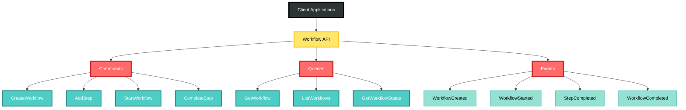
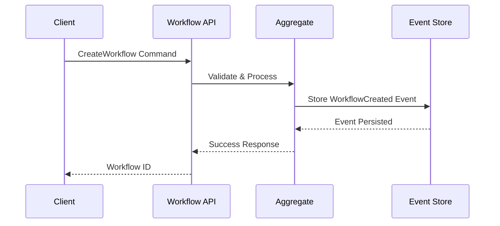

# Workflow API Documentation

## Overview



The Workflow domain API provides commands, queries, and events for comprehensive workflow management across all CIM domains.

## Commands



### CreateWorkflow

Creates a new workflow in the system.

```rust
use cim_domain_workflow::commands::CreateWorkflow;

let command = CreateWorkflow {
    id: WorkflowId::new(),
    // ... fields
};
```

**Fields:**
- `id`: Unique identifier for the workflow
- `field1`: Description
- `field2`: Description

**Validation:**
- Field1 must be non-empty
- Field2 must be valid

**Events Emitted:**
- `WorkflowCreated`

### UpdateWorkflow

Updates an existing workflow.

```rust
use cim_domain_workflow::commands::UpdateWorkflow;

let command = UpdateWorkflow {
    id: entity_id,
    // ... fields to update
};
```

**Fields:**
- `id`: Identifier of the workflow to update
- `field1`: New value (optional)

**Events Emitted:**
- `WorkflowUpdated`

## Queries

### GetWorkflowById

Retrieves a workflow by its identifier.

```rust
use cim_domain_workflow::queries::GetWorkflowById;

let query = GetWorkflowById {
    id: entity_id,
};
```

**Returns:** `Option<WorkflowView>`

### List{Entities}

Lists all {entities} with optional filtering.

```rust
use cim_domain_workflow::queries::List{Entities};

let query = List{Entities} {
    filter: Some(Filter {
        // ... filter criteria
    }),
    pagination: Some(Pagination {
        page: 1,
        per_page: 20,
    }),
};
```

**Returns:** `Vec<WorkflowView>`

## Events

### WorkflowCreated

Emitted when a new workflow is created.

```rust
#[derive(Debug, Clone, Serialize, Deserialize)]
pub struct WorkflowCreated {
    pub id: WorkflowId,
    pub timestamp: SystemTime,
    // ... other fields
}
```

### WorkflowUpdated

Emitted when a workflow is updated.

```rust
#[derive(Debug, Clone, Serialize, Deserialize)]
pub struct WorkflowUpdated {
    pub id: WorkflowId,
    pub changes: Vec<FieldChange>,
    pub timestamp: SystemTime,
}
```

## Value Objects

### WorkflowId

Unique identifier for {entities}.

```rust
#[derive(Debug, Clone, PartialEq, Eq, Hash, Serialize, Deserialize)]
pub struct WorkflowId(Uuid);

impl WorkflowId {
    pub fn new() -> Self {
        Self(Uuid::new_v4())
    }
}
```

### {ValueObject}

Represents {description}.

```rust
#[derive(Debug, Clone, PartialEq, Serialize, Deserialize)]
pub struct {ValueObject} {
    pub field1: String,
    pub field2: i32,
}
```

## Error Handling

The domain uses the following error types:

```rust
#[derive(Debug, thiserror::Error)]
pub enum WorkflowError {
    #[error("workflow not found: {id}")]
    NotFound { id: WorkflowId },
    
    #[error("Invalid {field}: {reason}")]
    ValidationError { field: String, reason: String },
    
    #[error("Operation not allowed: {reason}")]
    Forbidden { reason: String },
}
```

## Usage Examples

### Creating a New Workflow

```rust
use cim_domain_workflow::{
    commands::CreateWorkflow,
    handlers::handle_create_workflow,
};

#[tokio::main]
async fn main() -> Result<(), Box<dyn std::error::Error>> {
    let command = CreateWorkflow {
        id: WorkflowId::new(),
        name: "Example".to_string(),
        // ... other fields
    };
    
    let events = handle_create_workflow(command).await?;
    
    for event in events {
        println!("Event emitted: {:?}", event);
    }
    
    Ok(())
}
```

### Querying {Entities}

```rust
use cim_domain_workflow::{
    queries::{List{Entities}, execute_query},
};

#[tokio::main]
async fn main() -> Result<(), Box<dyn std::error::Error>> {
    let query = List{Entities} {
        filter: None,
        pagination: Some(Pagination {
            page: 1,
            per_page: 10,
        }),
    };
    
    let results = execute_query(query).await?;
    
    for item in results {
        println!("{:?}", item);
    }
    
    Ok(())
}
```

## Integration with Other Domains

This domain integrates with:

- **{Other Domain}**: Description of integration
- **{Other Domain}**: Description of integration

## Performance Considerations

- Commands are processed asynchronously
- Queries use indexed projections for fast retrieval
- Events are published to NATS for distribution

## Security Considerations

- All commands require authentication
- Authorization is enforced at the aggregate level
- Sensitive data is encrypted in events 