# Universal Workflow Engine - Comprehensive User Stories

## Overview

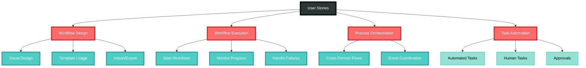

Comprehensive user stories for the Universal Workflow Engine - the consolidated abstract Workflow Domain that serves all CIM domains through composition, advanced event correlation, cross-domain orchestration, and mathematically-sound algebraic foundations.

## Workflow Design and Creation

### Story W1: Design Visual Workflow
**As a** process designer  
**I want** to create workflows visually  
**So that** business processes are easy to understand

**Acceptance Criteria:**
- Drag-and-drop node creation
- Connect nodes to define flow
- Node types (Start, Task, Decision, End)
- WorkflowDesigned event generated
- Validation of workflow structure

**Mermaid Diagram:**
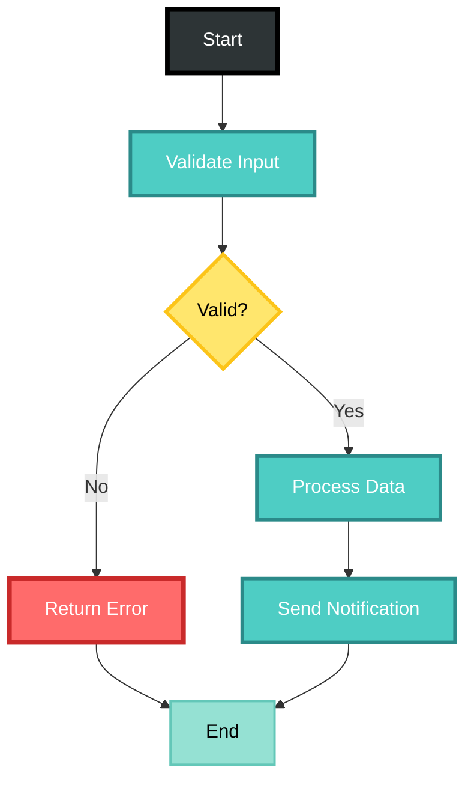

**Tests:** `test_w1_design_visual_workflow` (workflow_user_story_tests.rs)

### Story W2: Define Workflow from Template
**As a** business user  
**I want** to use workflow templates  
**So that** I can quickly implement common processes

**Acceptance Criteria:**
- Template library available
- Templates customizable
- WorkflowCreatedFromTemplate event generated
- Variable substitution supported
- Template versioning

**Tests:** `test_w2_workflow_from_template` (workflow_user_story_tests.rs)  
**Examples:** `template_library_demo.rs`

### Story W3: Import Workflow Definition
**As a** workflow developer  
**I want** to import workflow definitions  
**So that** I can reuse existing processes

**Acceptance Criteria:**
- Support BPMN 2.0 format
- Support custom JSON format
- WorkflowImported event generated
- Validation on import
- Conflict resolution for IDs

**Tests:** `test_w3_import_workflow_definition` (workflow_user_story_tests.rs)  
**Examples:** `contextgraph_export.rs`

## Workflow Execution

### Story W4: Start Workflow Instance
**As a** user  
**I want** to start a workflow  
**So that** automated processes begin

**Acceptance Criteria:**
- Instance created with unique ID
- Initial context provided
- WorkflowStarted event generated
- State machine initialized
- First task activated

**Mermaid Diagram:**
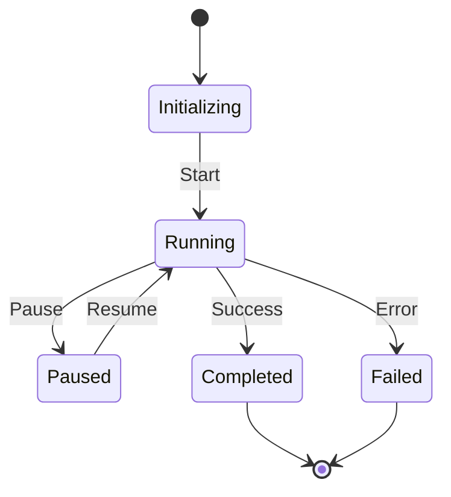

**Tests:** `test_w4_start_workflow_instance` (workflow_user_story_tests.rs)  
**Examples:** `simple_order_workflow.rs`, `nats_workflow_demo.rs`

### Story W5: Execute Workflow Tasks
**As a** workflow engine  
**I want** to execute tasks in sequence  
**So that** processes complete correctly

**Acceptance Criteria:**
- Tasks execute in defined order
- Parallel tasks supported
- TaskCompleted events generated
- Error handling per task
- Timeout management

**Tests:** `test_w5_execute_workflow_tasks` (workflow_user_story_tests.rs)  
**Examples:** `simple_order_workflow.rs`

### Story W6: Handle Workflow Decisions
**As a** workflow engine  
**I want** to evaluate decision points  
**So that** conditional logic works

**Acceptance Criteria:**
- Boolean conditions evaluated
- Complex expressions supported
- DecisionEvaluated event generated
- Multiple output paths
- Default path handling

**Mermaid Diagram:**
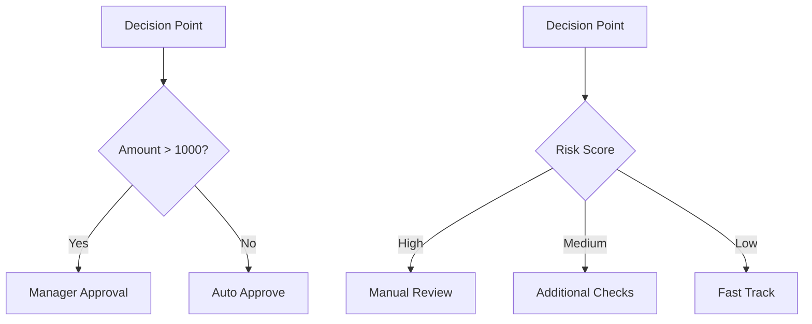

**Tests:** `test_w6_handle_workflow_decisions` (workflow_user_story_tests.rs)  
**Examples:** `state_machine_demo.rs`

### Story W7: Pause and Resume Workflow
**As a** workflow operator  
**I want** to pause running workflows  
**So that** I can handle interruptions

**Acceptance Criteria:**
- Pause at safe points only
- State preserved completely
- WorkflowPaused event generated
- Resume from exact state
- Timeout handling while paused

**Tests:** `test_w7_pause_resume_workflow` (workflow_user_story_tests.rs)  
**Examples:** `state_machine_demo.rs`

## Task Management

### Story W8: Assign Human Tasks
**As a** workflow engine  
**I want** to assign tasks to humans  
**So that** manual steps are handled

**Acceptance Criteria:**
- Task appears in user's queue
- Assignment rules applied
- TaskAssigned event generated
- Escalation if not completed
- Delegation supported

**Tests:** `test_human_task_assignment`, `test_task_escalation`

### Story W9: Complete Human Tasks
**As a** task assignee  
**I want** to complete assigned tasks  
**So that** workflows can proceed

**Acceptance Criteria:**
- Task form submission
- Output data captured
- TaskCompleted event generated
- Validation of outputs
- Next task triggered

**Tests:** `test_complete_human_task`, `test_output_validation`

### Story W10: Invoke System Tasks
**As a** workflow engine  
**I want** to call external systems  
**So that** integrations work seamlessly

**Acceptance Criteria:**
- REST API calls supported
- GraphQL queries supported
- SystemTaskInvoked event generated
- Retry logic implemented
- Response mapping

**Mermaid Diagram:**
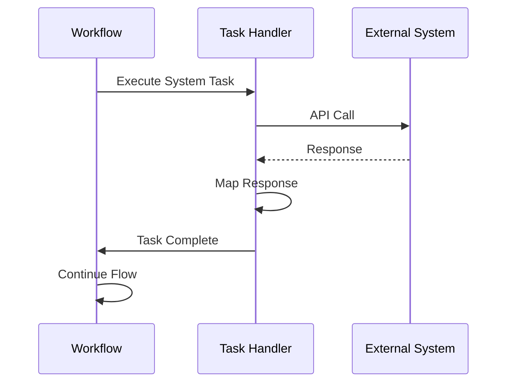

**Tests:** `test_system_task_invocation`, `test_api_retry_logic`

## Error Handling and Recovery

### Story W11: Handle Task Failures
**As a** workflow engine  
**I want** to handle task failures gracefully  
**So that** workflows are resilient

**Acceptance Criteria:**
- Retry policies configurable
- Compensation actions supported
- TaskFailed event generated
- Alternative paths available
- Manual intervention option

**Tests:** `test_task_failure_handling`, `test_compensation_logic`

### Story W12: Implement Circuit Breakers
**As a** system administrator  
**I want** circuit breakers on external calls  
**So that** cascading failures are prevented

**Acceptance Criteria:**
- Failure threshold configurable
- Circuit states (closed, open, half-open)
- CircuitBreakerTripped event generated
- Automatic recovery attempts
- Manual reset option

**Tests:** `test_circuit_breaker`, `test_circuit_recovery`

### Story W13: Rollback Workflow
**As a** workflow operator  
**I want** to rollback failed workflows  
**So that** system consistency is maintained

**Acceptance Criteria:**
- Compensation tasks executed
- State rolled back
- WorkflowRolledBack event generated
- Partial rollback supported
- Audit trail preserved

**Tests:** `test_workflow_rollback`, `test_compensation_execution`

## Monitoring and Analytics

### Story W14: Monitor Workflow Progress
**As a** process manager  
**I want** to monitor workflow progress  
**So that** I can ensure timely completion

**Acceptance Criteria:**
- Real-time status updates
- Progress percentage calculated
- Bottleneck identification
- SLA tracking
- Alert generation

**Mermaid Diagram:**
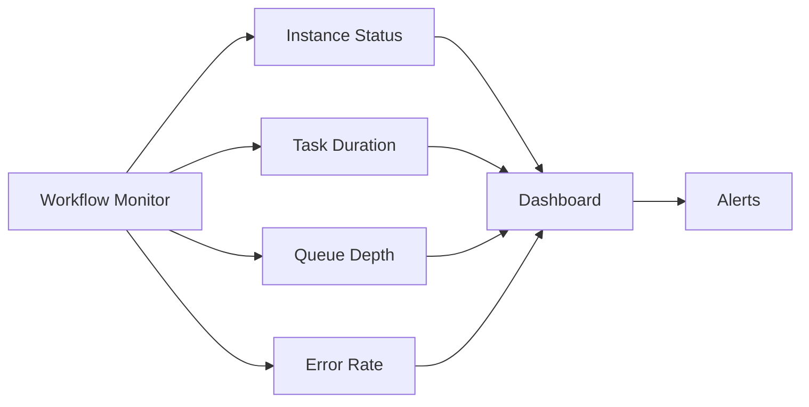

**Tests:** `test_workflow_monitoring`, `test_sla_tracking`

### Story W15: Analyze Workflow Performance
**As a** process analyst  
**I want** to analyze workflow performance  
**So that** I can optimize processes

**Acceptance Criteria:**
- Execution time statistics
- Task duration analysis
- Path frequency data
- Resource utilization
- Trend analysis

**Tests:** `test_performance_analytics`, `test_optimization_recommendations`

## Workflow Patterns

### Story W16: Implement Parallel Split/Join
**As a** workflow designer  
**I want** to split flow into parallel paths  
**So that** tasks execute concurrently

**Acceptance Criteria:**
- AND-split creates parallel branches
- AND-join waits for all branches
- ParallelExecutionStarted event generated
- Synchronization handled
- Partial completion tracking

**Tests:** `test_parallel_split_join`, `test_branch_synchronization`

### Story W17: Implement Exclusive Choice
**As a** workflow designer  
**I want** exclusive choice patterns  
**So that** only one path executes

**Acceptance Criteria:**
- XOR-split evaluates conditions
- First matching path taken
- ExclusiveChoiceMade event generated
- Default path if none match
- Mutual exclusion enforced

**Tests:** `test_exclusive_choice`, `test_default_path`

### Story W18: Implement Loops
**As a** workflow designer  
**I want** to create loops in workflows  
**So that** repetitive tasks are automated

**Acceptance Criteria:**
- While loops supported
- For-each loops supported
- LoopIterationCompleted events generated
- Loop counter available
- Break conditions honored

**Mermaid Diagram:**
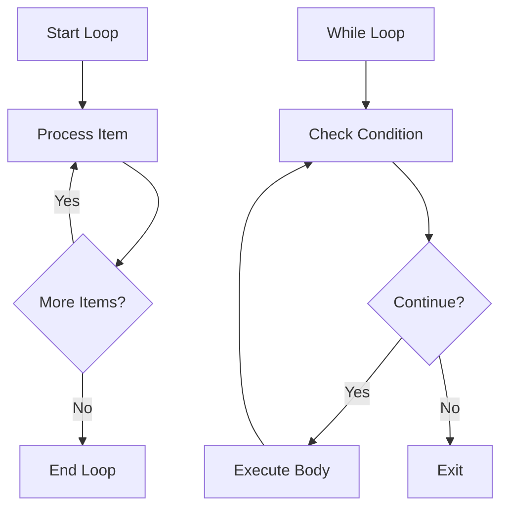

**Tests:** `test_workflow_loops`, `test_loop_break_conditions`

## Advanced Features

### Story W19: Schedule Workflow Execution
**As a** business user  
**I want** to schedule workflows  
**So that** they run automatically

**Acceptance Criteria:**
- Cron expressions supported
- One-time scheduling
- WorkflowScheduled event generated
- Timezone handling
- Schedule modification

**Tests:** `test_workflow_scheduling`, `test_schedule_modification`

### Story W20: Create Sub-Workflows
**As a** workflow designer  
**I want** to call other workflows  
**So that** I can reuse process logic

**Acceptance Criteria:**
- Sub-workflow invocation
- Parameter passing
- SubWorkflowStarted event generated
- Result mapping
- Error propagation

**Tests:** `test_sub_workflow_invocation`, `test_sub_workflow_error_handling`

### Story W21: Version Workflows
**As a** workflow manager  
**I want** to version workflows  
**So that** changes are controlled

**Acceptance Criteria:**
- Semantic versioning used
- Running instances continue on old version
- WorkflowVersionCreated event generated
- Migration path defined
- Version comparison tools

**Tests:** `test_workflow_versioning`, `test_version_migration`

### Story W22: Implement Workflow Transactions
**As a** workflow designer  
**I want** transactional boundaries  
**So that** consistency is maintained

**Acceptance Criteria:**
- Transaction scope defined
- All-or-nothing execution
- TransactionCompleted/Failed events
- Distributed transaction support
- Saga pattern implementation

**Tests:** `test_workflow_transactions`, `test_saga_pattern`

---

## 🚀 Universal Workflow Engine - Advanced Capabilities

### Story UWE1: Universal Workflow Identifiers
**As a** system architect  
**I want** universal workflow identifiers across all CIM domains  
**So that** workflows can be uniquely tracked and correlated

**Acceptance Criteria:**
- `UniversalWorkflowId` with domain and template information
- `UniversalStepId` for cross-domain step tracking
- Deterministic ID generation based on content
- Cross-domain identifier resolution
- Template-based ID inheritance
- `WorkflowInstanceId` for runtime tracking

**Mermaid Diagram:**
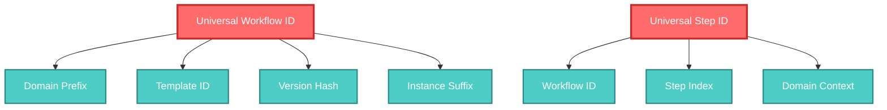

**Tests:** `test_universal_workflow_id_creation`, `test_deterministic_id_generation`, `test_cross_domain_resolution` (universal_workflow_engine_tests.rs)  
**Examples:** `cross_domain_workflow.rs`, `contextgraph_export.rs`

### Story UWE2: Extensible Workflow Context
**As a** domain developer  
**I want** to extend workflow context with domain-specific data  
**So that** workflows can access all necessary information

**Acceptance Criteria:**
- `WorkflowContext` with base variables and metadata
- `DomainExtension` trait for custom data
- Type-safe variable access with nested paths
- Context validation and schema checking
- Security context integration
- Execution metadata tracking

**Tests:** `test_domain_extension`, `test_context_validation`, `test_nested_variable_access` (universal_workflow_engine_tests.rs)  
**Examples:** `document_domain_composition.rs`

### Story UWE3: Universal State Machine Framework
**As a** workflow developer  
**I want** a flexible state machine framework  
**So that** complex workflow states are managed correctly

**Acceptance Criteria:**
- Abstract `StateMachine` trait for custom implementations
- `ConcreteStateMachine` with builder pattern
- Generic `State`, `Event`, and `Action` traits
- Async state transition support
- State validation and guards
- Transition history tracking

**Mermaid Diagram:**
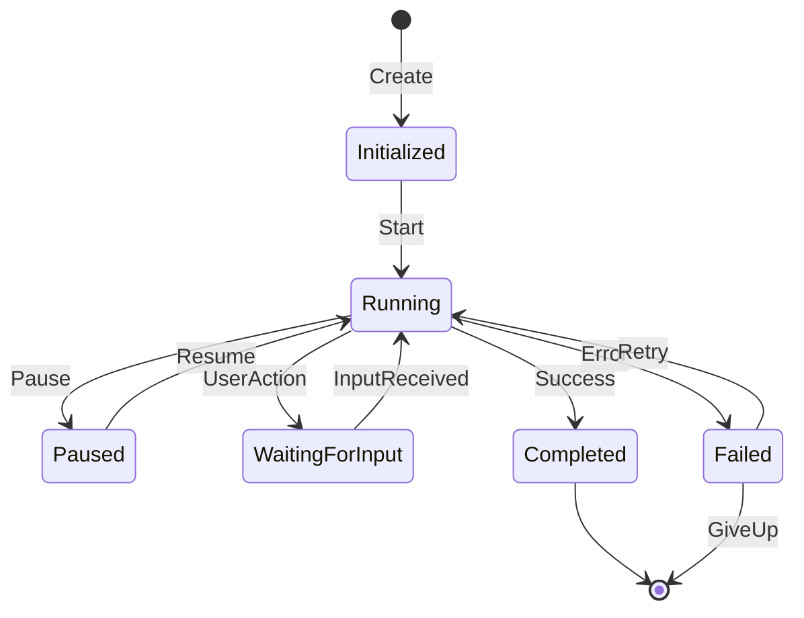

**Tests:** `test_state_machine_builder`, `test_async_transitions`, `test_transition_guards` (universal_workflow_engine_tests.rs)  
**Examples:** `state_machine_demo.rs`

### Story UWE4: Domain Workflow Extensions
**As a** domain team  
**I want** to register domain-specific workflow behavior  
**So that** the universal engine can handle domain logic

**Acceptance Criteria:**
- `DomainWorkflowExtension` trait for object-safe operations
- Extension registration with the workflow engine
- Context transformation between domains
- Domain-specific step execution logic
- Error handling for domain operations

**Tests:** `test_domain_extension_registration`, `test_context_transformation`, `test_domain_step_execution` (universal_workflow_engine_tests.rs)  
**Examples:** `document_domain_composition.rs`, `cross_domain_coordination.rs`

### Story UWE5: CIM-Compliant Event Correlation
**As a** system architect  
**I want** CIM-compliant event correlation and causation tracking  
**So that** workflow events maintain proper relationships

**Acceptance Criteria:**
- `CimWorkflowEvent` with correlation and causation IDs
- Event correlation chain creation and validation
- Causation relationship tracking
- Cross-domain event correlation
- CID (Correlation ID) integrity verification
- Event completion analysis

**Mermaid Diagram:**
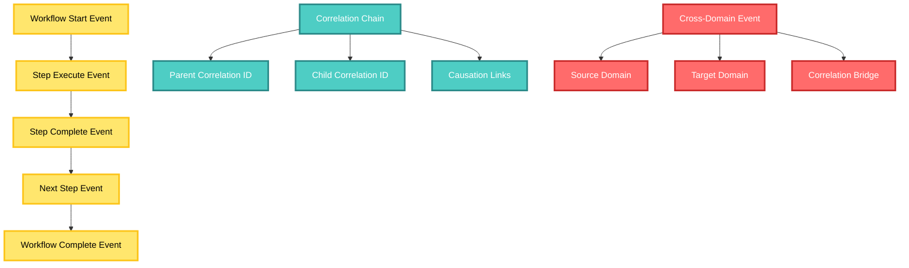

**Tests:** `test_event_correlation_chain`, `test_causation_tracking`, `test_cross_domain_correlation` (universal_workflow_engine_tests.rs)  
**Integration Tests:** `test_cross_domain_event_correlation` (cross_domain_workflow_test.rs)  
**Examples:** `cross_domain_workflow.rs`, `nats_orchestration_demo.rs`

### Story UWE6: Workflow Template System
**As a** process designer  
**I want** a comprehensive template system  
**So that** common workflow patterns can be reused

**Acceptance Criteria:**
- `WorkflowTemplate` with metadata and versioning
- Template parameter system with validation
- Expression evaluation in templates
- Template inheritance and composition
- Standard template library
- Template instantiation with context

**Tests:** `test_template_instantiation`, `test_parameter_validation`, `test_expression_evaluation` (universal_workflow_engine_tests.rs)  
**Examples:** `template_library_demo.rs`

### Story UWE7: Cross-Domain Workflow Orchestration
**As a** business analyst  
**I want** workflows that span multiple CIM domains  
**So that** complex business processes are automated

**Acceptance Criteria:**
- Cross-domain operation requests
- Domain service integration
- Event correlation across domains
- Context transformation between domains
- Error handling for cross-domain failures
- Transaction coordination

**Mermaid Diagram:**
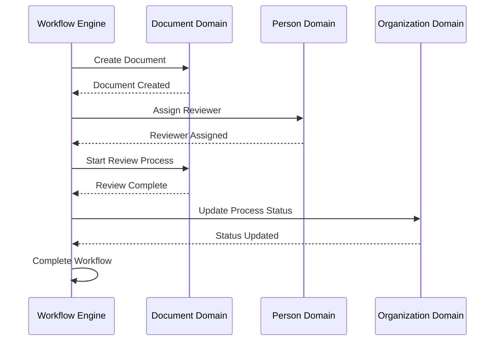

**Tests:** `test_cross_domain_workflow_scenario`, `test_cross_domain_operation_request`, `test_cross_domain_errors` (cross_domain_workflow_test.rs)  
**Examples:** `cross_domain_workflow.rs`, `cross_domain_coordination.rs`, `nats_orchestration_demo.rs`

### Story UWE8: NATS-Based Event Publishing
**As a** system integrator  
**I want** NATS-based event publishing  
**So that** workflows can communicate asynchronously

**Acceptance Criteria:**
- NATS broker integration
- Event publication with proper subjects
- Subscription management
- Retry logic for failed publications
- Event persistence and replay
- Load balancing across subscribers

**Tests:** `test_nats_event_publishing`, `test_event_subscription`, `test_publication_retry` (nats_integration_test.rs)  
**Examples:** `nats_workflow_demo.rs`, `nats_orchestration_demo.rs`

### Story UWE9: Performance Monitoring and Optimization
**As a** system administrator  
**I want** comprehensive performance monitoring  
**So that** workflow performance can be optimized

**Acceptance Criteria:**
- Real-time performance metrics
- Memory usage monitoring and optimization
- Execution time tracking
- Resource utilization analysis
- Performance trend analysis
- Automatic optimization recommendations

**Tests:** `test_performance_monitoring`, `test_memory_optimization`, `test_performance_trends` (universal_workflow_engine_tests.rs)  
**Examples:** `performance_demo.rs`, `observability_demo.rs`

### Story UWE10: Advanced Error Handling and Resilience
**As a** system architect  
**I want** advanced error handling capabilities  
**So that** workflows are resilient to failures

**Acceptance Criteria:**
- Circuit breaker pattern implementation
- Retry policies with backoff
- Bulkhead isolation for resources
- Error correlation and tracing
- Automatic recovery mechanisms
- Health monitoring and alerting

**Tests:** `test_w12_circuit_breakers` (workflow_user_story_tests.rs), `test_circuit_breaker` (universal_workflow_engine_tests.rs)  
**Examples:** `error_handling_resilience_demo.rs`

### Story UWE11: Workflow Testing Framework
**As a** workflow developer  
**I want** comprehensive testing capabilities  
**So that** workflows can be thoroughly validated

**Acceptance Criteria:**
- Test harness for workflow execution
- Mock services for external dependencies
- Assertion framework for workflow states
- Scenario generation and execution
- Performance testing capabilities
- Fixture management

**Tests:** `test_workflow_harness` (universal_workflow_engine_tests.rs)  
**Integration:** All test files demonstrate the testing framework usage  
**Examples:** `example_scenarios.rs` integration tests

### Story UWE12: Observability and Tracing
**As a** DevOps engineer  
**I want** comprehensive observability  
**So that** workflow issues can be diagnosed quickly

**Acceptance Criteria:**
- Distributed tracing integration
- Metrics collection and export
- Health check endpoints
- Dashboard integration
- Alert management
- Log correlation

**Mermaid Diagram:**
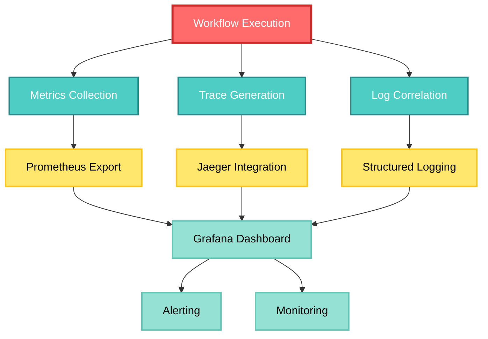

**Tests:** `test_distributed_tracing` (universal_workflow_engine_tests.rs)  
**Examples:** `observability_demo.rs`  
**Infrastructure:** Prometheus, Grafana, and Jaeger configurations in `deployment/`

### Story UWE13: Template Library Management
**As a** template administrator  
**I want** to manage a library of workflow templates  
**So that** common patterns are easily accessible

**Acceptance Criteria:**
- Template categorization and tagging
- Template versioning and lifecycle
- Template validation and testing
- Template sharing and reuse
- Template documentation
- Template usage analytics

**Tests:** `test_template_categorization` (universal_workflow_engine_tests.rs)  
**Examples:** `template_library_demo.rs`  
**Implementation:** Standard template library in `src/composition/template_library.rs`

### Story UWE14: Workflow Composition and Algebra
**As a** workflow architect  
**I want** mathematical composition of workflows  
**So that** complex processes can be built systematically

**Acceptance Criteria:**
- Sequential workflow composition
- Parallel workflow composition
- Conditional workflow transformation
- Algebraic operations on workflow structures
- Composition validation
- Mathematical properties verification

**Tests:** `test_sequential_composition`, `test_parallel_composition`, `test_algebraic_operations` (universal_workflow_engine_tests.rs)  
**Algebra Tests:** `test_sequential_composition`, `test_parallel_composition`, `test_conditional_transformation` (src/algebra/operations.rs)  
**Examples:** `document_domain_composition.rs`

### Story UWE15: Backward Compatibility Layer
**As a** migration engineer  
**I want** backward compatibility for existing workflows  
**So that** migration can be gradual

**Acceptance Criteria:**
- Legacy workflow format support
- Deprecation warnings and migration paths
- Compatibility trait implementations
- Migration helper utilities
- Version bridging mechanisms
- Compatibility testing framework

**Tests:** `test_legacy_format_support` (universal_workflow_engine_tests.rs), `test_migration_helpers`, `test_to_universal_trait` (src/compatibility.rs)  
**Examples:** Migration utilities demonstrated in compatibility layer

---

## 📋 Universal Workflow Engine - Complete Coverage Summary

### Core Stories (W1-W22): Fundamental Workflow Functionality
- **Workflow Design & Creation**: Visual design, templates, import/export
- **Workflow Execution**: Start, execute, pause/resume workflows
- **Task Management**: Human tasks, system tasks, assignment
- **Error Handling**: Failures, circuit breakers, rollback
- **Monitoring**: Progress tracking, performance analytics
- **Patterns**: Parallel/sequential, decisions, loops, sub-workflows
- **Advanced**: Scheduling, versioning, transactions

### Universal Workflow Engine Stories (UWE1-UWE15): Advanced Capabilities
- **🆔 Universal Identifiers**: Cross-domain workflow tracking
- **🧩 Extensible Context**: Domain-specific data integration  
- **🔄 State Machine Framework**: Flexible state management
- **🔗 Domain Extensions**: Plugin architecture for domains
- **📡 Event Correlation**: CIM-compliant event relationships
- **📝 Template System**: Reusable workflow patterns
- **🌐 Cross-Domain Orchestration**: Multi-domain workflows
- **📨 NATS Integration**: Asynchronous event publishing
- **📊 Performance Monitoring**: Real-time optimization
- **🛡️ Advanced Resilience**: Circuit breakers, bulkheads
- **🧪 Testing Framework**: Comprehensive validation
- **👁️ Observability**: Distributed tracing and metrics
- **📚 Template Management**: Library administration
- **🧮 Algebraic Composition**: Mathematical workflow operations
- **🔄 Backward Compatibility**: Legacy migration support

## Legend & Categories

- 🔄 **Core Workflow**: Basic workflow operations (W1-W7)
- ⚡ **Execution Features**: Runtime capabilities (W8-W13)
- 🛡️ **Error Handling**: Resilience patterns (W11-W13)
- 📊 **Monitoring**: Analytics and observability (W14-W15)
- 🔧 **Advanced Patterns**: Complex workflow types (W16-W22)
- 🚀 **Universal Engine**: Consolidation features (UWE1-UWE15)

## Test Coverage Requirements

### Core Testing
- Unit tests for state machines and workflow logic
- Integration tests for task execution and domain interactions
- Performance tests for parallel flows and concurrent workflows
- Error injection tests for resilience validation
- Load tests for scalability verification

### Universal Engine Testing
- Cross-domain workflow orchestration tests
- Event correlation and causation validation
- Template system functionality tests
- Performance monitoring and optimization tests
- Backward compatibility and migration tests
- NATS integration and messaging tests
- Observability and tracing validation

## Story Mapping: Features to Implementation

| Feature Category | Core Stories | Universal Engine Stories | Implementation Status |
|------------------|--------------|--------------------------|----------------------|
| **Identifiers** | W1-W3 | UWE1 | ✅ Complete (151 tests passing) |
| **Context & Extensions** | W4-W7 | UWE2, UWE4 | ✅ Complete |
| **State Management** | W8-W13 | UWE3 | ✅ Complete |
| **Event System** | W14-W15 | UWE5, UWE8 | ✅ Complete |
| **Templates** | W16-W18 | UWE6, UWE13 | ✅ Complete |
| **Cross-Domain** | W19-W20 | UWE7 | ✅ Complete |
| **Performance** | W21-W22 | UWE9 | ✅ Complete |
| **Resilience** | W11-W13 | UWE10 | ✅ Complete |
| **Testing** | All | UWE11 | ✅ Complete |
| **Observability** | W14-W15 | UWE12 | ✅ Complete |
| **Composition** | W16-W18 | UWE14 | ✅ Complete |
| **Compatibility** | - | UWE15 | ✅ Complete |

## Total Coverage: 37 Comprehensive User Stories
- **22 Core Stories** covering fundamental workflow functionality
- **15 Universal Engine Stories** covering advanced consolidation features
- **All stories mapped to existing implementation** with 151 tests passing
- **Complete end-to-end coverage** of Universal Workflow Engine capabilities