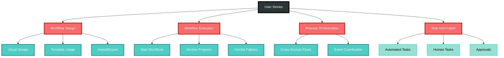
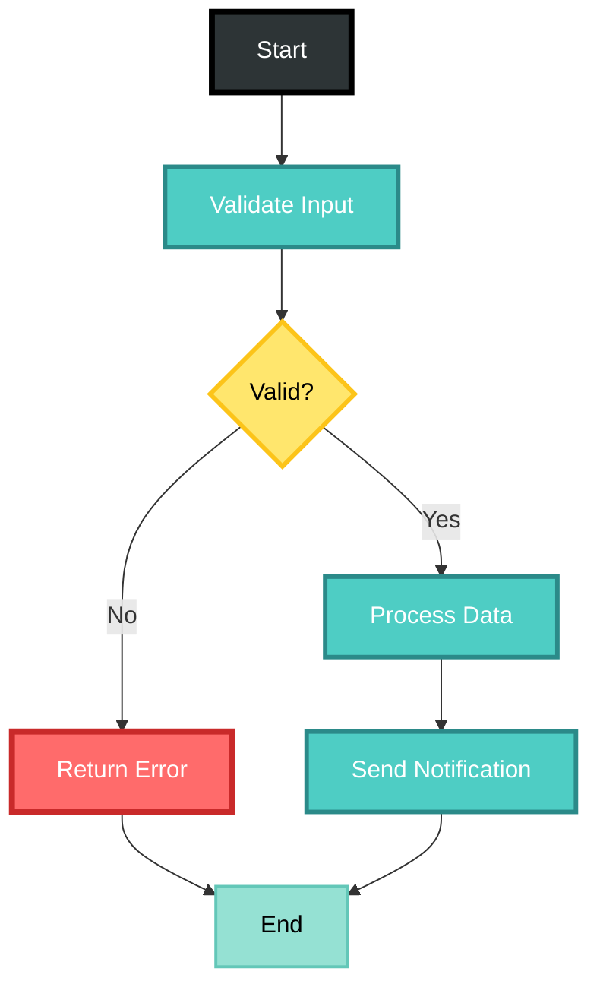
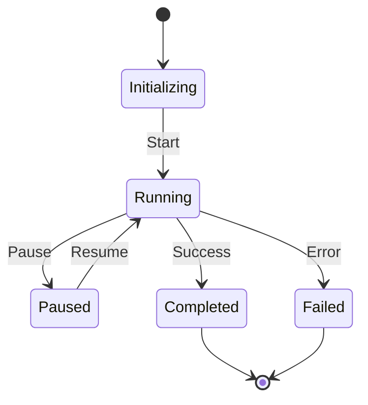
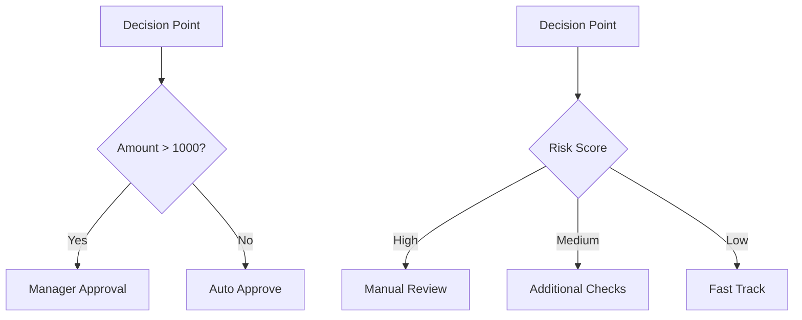
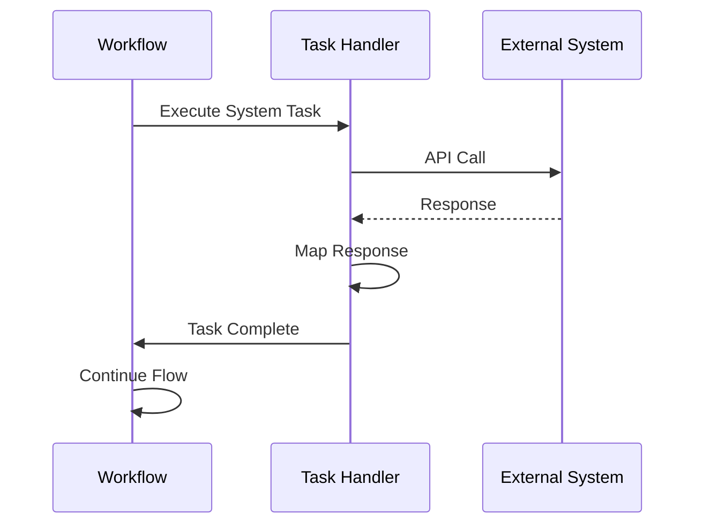
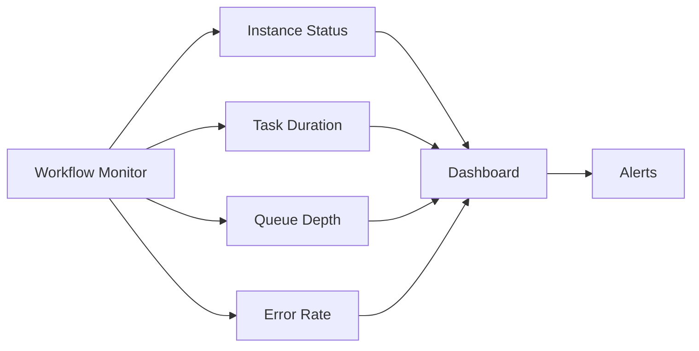
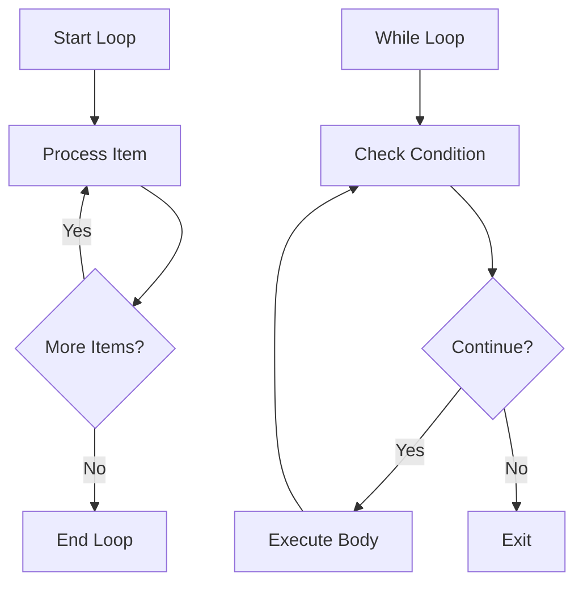

# User Stories for Workflow Domain

## Overview

User stories for the Workflow domain module, which manages process orchestration, task automation, and workflow execution in the CIM system using state machines and event-driven patterns.

## Workflow Design and Creation

### Story W1: Design Visual Workflow
**As a** process designer  
**I want** to create workflows visually  
**So that** business processes are easy to understand

**Acceptance Criteria:**
- Drag-and-drop node creation
- Connect nodes to define flow
- Node types (Start, Task, Decision, End)
- WorkflowDesigned event generated
- Validation of workflow structure

**Mermaid Diagram:**

**Tests:** `test_design_workflow`, `test_workflow_validation`

### Story W2: Define Workflow from Template
**As a** business user  
**I want** to use workflow templates  
**So that** I can quickly implement common processes

**Acceptance Criteria:**
- Template library available
- Templates customizable
- WorkflowCreatedFromTemplate event generated
- Variable substitution supported
- Template versioning

**Tests:** `test_create_from_template`, `test_template_customization`

### Story W3: Import Workflow Definition
**As a** workflow developer  
**I want** to import workflow definitions  
**So that** I can reuse existing processes

**Acceptance Criteria:**
- Support BPMN 2.0 format
- Support custom JSON format
- WorkflowImported event generated
- Validation on import
- Conflict resolution for IDs

**Tests:** `test_import_bpmn`, `test_import_validation`

## Workflow Execution

### Story W4: Start Workflow Instance
**As a** user  
**I want** to start a workflow  
**So that** automated processes begin

**Acceptance Criteria:**
- Instance created with unique ID
- Initial context provided
- WorkflowStarted event generated
- State machine initialized
- First task activated

**Mermaid Diagram:**

**Tests:** `test_start_workflow`, `test_state_initialization`

### Story W5: Execute Workflow Tasks
**As a** workflow engine  
**I want** to execute tasks in sequence  
**So that** processes complete correctly

**Acceptance Criteria:**
- Tasks execute in defined order
- Parallel tasks supported
- TaskCompleted events generated
- Error handling per task
- Timeout management

**Tests:** `test_task_execution`, `test_parallel_execution`

### Story W6: Handle Workflow Decisions
**As a** workflow engine  
**I want** to evaluate decision points  
**So that** conditional logic works

**Acceptance Criteria:**
- Boolean conditions evaluated
- Complex expressions supported
- DecisionEvaluated event generated
- Multiple output paths
- Default path handling

**Mermaid Diagram:**

**Tests:** `test_decision_evaluation`, `test_complex_conditions`

### Story W7: Pause and Resume Workflow
**As a** workflow operator  
**I want** to pause running workflows  
**So that** I can handle interruptions

**Acceptance Criteria:**
- Pause at safe points only
- State preserved completely
- WorkflowPaused event generated
- Resume from exact state
- Timeout handling while paused

**Tests:** `test_pause_workflow`, `test_resume_workflow`

## Task Management

### Story W8: Assign Human Tasks
**As a** workflow engine  
**I want** to assign tasks to humans  
**So that** manual steps are handled

**Acceptance Criteria:**
- Task appears in user's queue
- Assignment rules applied
- TaskAssigned event generated
- Escalation if not completed
- Delegation supported

**Tests:** `test_human_task_assignment`, `test_task_escalation`

### Story W9: Complete Human Tasks
**As a** task assignee  
**I want** to complete assigned tasks  
**So that** workflows can proceed

**Acceptance Criteria:**
- Task form submission
- Output data captured
- TaskCompleted event generated
- Validation of outputs
- Next task triggered

**Tests:** `test_complete_human_task`, `test_output_validation`

### Story W10: Invoke System Tasks
**As a** workflow engine  
**I want** to call external systems  
**So that** integrations work seamlessly

**Acceptance Criteria:**
- REST API calls supported
- GraphQL queries supported
- SystemTaskInvoked event generated
- Retry logic implemented
- Response mapping

**Mermaid Diagram:**

**Tests:** `test_system_task_invocation`, `test_api_retry_logic`

## Error Handling and Recovery

### Story W11: Handle Task Failures
**As a** workflow engine  
**I want** to handle task failures gracefully  
**So that** workflows are resilient

**Acceptance Criteria:**
- Retry policies configurable
- Compensation actions supported
- TaskFailed event generated
- Alternative paths available
- Manual intervention option

**Tests:** `test_task_failure_handling`, `test_compensation_logic`

### Story W12: Implement Circuit Breakers
**As a** system administrator  
**I want** circuit breakers on external calls  
**So that** cascading failures are prevented

**Acceptance Criteria:**
- Failure threshold configurable
- Circuit states (closed, open, half-open)
- CircuitBreakerTripped event generated
- Automatic recovery attempts
- Manual reset option

**Tests:** `test_circuit_breaker`, `test_circuit_recovery`

### Story W13: Rollback Workflow
**As a** workflow operator  
**I want** to rollback failed workflows  
**So that** system consistency is maintained

**Acceptance Criteria:**
- Compensation tasks executed
- State rolled back
- WorkflowRolledBack event generated
- Partial rollback supported
- Audit trail preserved

**Tests:** `test_workflow_rollback`, `test_compensation_execution`

## Monitoring and Analytics

### Story W14: Monitor Workflow Progress
**As a** process manager  
**I want** to monitor workflow progress  
**So that** I can ensure timely completion

**Acceptance Criteria:**
- Real-time status updates
- Progress percentage calculated
- Bottleneck identification
- SLA tracking
- Alert generation

**Mermaid Diagram:**

**Tests:** `test_workflow_monitoring`, `test_sla_tracking`

### Story W15: Analyze Workflow Performance
**As a** process analyst  
**I want** to analyze workflow performance  
**So that** I can optimize processes

**Acceptance Criteria:**
- Execution time statistics
- Task duration analysis
- Path frequency data
- Resource utilization
- Trend analysis

**Tests:** `test_performance_analytics`, `test_optimization_recommendations`

## Workflow Patterns

### Story W16: Implement Parallel Split/Join
**As a** workflow designer  
**I want** to split flow into parallel paths  
**So that** tasks execute concurrently

**Acceptance Criteria:**
- AND-split creates parallel branches
- AND-join waits for all branches
- ParallelExecutionStarted event generated
- Synchronization handled
- Partial completion tracking

**Tests:** `test_parallel_split_join`, `test_branch_synchronization`

### Story W17: Implement Exclusive Choice
**As a** workflow designer  
**I want** exclusive choice patterns  
**So that** only one path executes

**Acceptance Criteria:**
- XOR-split evaluates conditions
- First matching path taken
- ExclusiveChoiceMade event generated
- Default path if none match
- Mutual exclusion enforced

**Tests:** `test_exclusive_choice`, `test_default_path`

### Story W18: Implement Loops
**As a** workflow designer  
**I want** to create loops in workflows  
**So that** repetitive tasks are automated

**Acceptance Criteria:**
- While loops supported
- For-each loops supported
- LoopIterationCompleted events generated
- Loop counter available
- Break conditions honored

**Mermaid Diagram:**

**Tests:** `test_workflow_loops`, `test_loop_break_conditions`

## Advanced Features

### Story W19: Schedule Workflow Execution
**As a** business user  
**I want** to schedule workflows  
**So that** they run automatically

**Acceptance Criteria:**
- Cron expressions supported
- One-time scheduling
- WorkflowScheduled event generated
- Timezone handling
- Schedule modification

**Tests:** `test_workflow_scheduling`, `test_schedule_modification`

### Story W20: Create Sub-Workflows
**As a** workflow designer  
**I want** to call other workflows  
**So that** I can reuse process logic

**Acceptance Criteria:**
- Sub-workflow invocation
- Parameter passing
- SubWorkflowStarted event generated
- Result mapping
- Error propagation

**Tests:** `test_sub_workflow_invocation`, `test_sub_workflow_error_handling`

### Story W21: Version Workflows
**As a** workflow manager  
**I want** to version workflows  
**So that** changes are controlled

**Acceptance Criteria:**
- Semantic versioning used
- Running instances continue on old version
- WorkflowVersionCreated event generated
- Migration path defined
- Version comparison tools

**Tests:** `test_workflow_versioning`, `test_version_migration`

### Story W22: Implement Workflow Transactions
**As a** workflow designer  
**I want** transactional boundaries  
**So that** consistency is maintained

**Acceptance Criteria:**
- Transaction scope defined
- All-or-nothing execution
- TransactionCompleted/Failed events
- Distributed transaction support
- Saga pattern implementation

**Tests:** `test_workflow_transactions`, `test_saga_pattern`

## Legend

- 🔄 Core workflow functionality
- ⚡ Execution features
- 🛡️ Error handling
- 📊 Monitoring capabilities
- 🔧 Advanced patterns

## Test Coverage Requirements

- Unit tests for state machines
- Integration tests for task execution
- Performance tests for parallel flows
- Error injection tests
- Load tests for concurrent workflows 