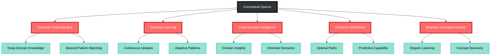
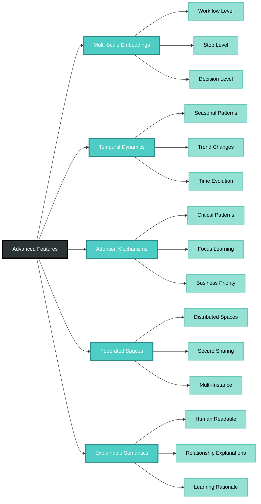

# Hopfield Networks for CIM Conceptual Spaces (with Rust Examples)

**Main idea**  
Hopfield networks in CIM serve as the foundational neural architecture for building and maintaining **conceptual spaces**—semantic embedding spaces where workflow patterns, domain relationships, and business knowledge are encoded as stable attractors. In-transit workflows continuously feed input data that updates these conceptual spaces through associative memory mechanisms, enabling the CIM to develop semantic understanding of domain relationships and predict optimal workflow paths.

***

## 1  Conceptual Space Architecture

| CIM Component | Hopfield Role | Conceptual Space Function |
|---------------|---------------|---------------------------|
| Domain Events | Input Neurons | Semantic features in conceptual space |
| Workflow Patterns | Stored Attractors | Stable semantic clusters representing business concepts |
| In-transit Data | Dynamic Input | Real-time updates to conceptual understanding |
| Business Rules | Energy Landscape | Semantic constraints and relationships |
| Cross-Domain Links | Inter-network Connections | Bridges between conceptual spaces |

The **conceptual space** is a high-dimensional semantic embedding where similar workflows, domain concepts, and business patterns cluster together. Hopfield networks maintain these spaces by:
- **Storing** successful workflow patterns as stable attractors
- **Updating** conceptual relationships based on in-transit workflow data  
- **Retrieving** semantically similar patterns for workflow optimization
- **Bridging** different domain conceptual spaces through shared semantic dimensions

***

## 2  Rust Implementation with Conceptual Spaces

### 2.1 Enhanced Dependencies

```toml
[dependencies]
cim-domain-workflow = { path = "../" }
tokio = { version = "1", features = ["macros", "rt-multi-thread"] }
async-nats = "0.41"
serde = { version = "1", features = ["derive"] }
ndarray = "0.15"
uuid = { version = "1.11", features = ["v4", "serde"] }
# Neural network math
faer = "0.19"  # High-performance linear algebra
candle = "0.6"  # ML framework for semantic embeddings
```

### 2.2 Conceptual Space Domain Model

```rust
use cim_domain_workflow::*;
use serde::{Deserialize, Serialize};
use std::collections::HashMap;
use uuid::Uuid;

/// Represents a conceptual space maintained by Hopfield networks
#[derive(Debug, Clone, Serialize, Deserialize)]
pub struct ConceptualSpace {
    /// Unique identifier for this conceptual space
    pub space_id: Uuid,
    /// Domain this space represents (e.g., "order_management", "logistics")
    pub domain: String,
    /// Dimensionality of the semantic embedding
    pub dimensions: usize,
    /// Current semantic embedding vectors
    pub embeddings: HashMap<String, Vec<f64>>,
    /// Hopfield network weights (concept relationships)
    pub weights: ndarray::Array2<f64>,
    /// Active workflow patterns being tracked
    pub active_patterns: Vec<WorkflowPattern>,
    /// Cross-domain bridges to other conceptual spaces
    pub bridges: HashMap<String, ConceptualBridge>,
    /// Last update timestamp
    pub last_updated: chrono::DateTime<chrono::Utc>,
}

/// Pattern representing a workflow's conceptual signature
#[derive(Debug, Clone, Serialize, Deserialize)]
pub struct WorkflowPattern {
    /// Pattern identifier
    pub pattern_id: Uuid,
    /// Source workflow that generated this pattern
    pub workflow_id: Uuid,
    /// Semantic embedding vector
    pub embedding: Vec<f64>,
    /// Pattern strength (how stable this attractor is)
    pub stability: f64,
    /// Frequency of occurrence
    pub frequency: u64,
    /// Associated business concepts
    pub concepts: Vec<String>,
}

/// Bridge connecting conceptual spaces across domains
#[derive(Debug, Clone, Serialize, Deserialize)]
pub struct ConceptualBridge {
    /// Target conceptual space
    pub target_space_id: Uuid,
    /// Shared semantic dimensions
    pub shared_dimensions: Vec<usize>,
    /// Translation matrix between spaces
    pub translation_weights: ndarray::Array2<f64>,
    /// Bridge strength
    pub strength: f64,
}

/// In-transit workflow data that updates conceptual spaces
#[derive(Debug, Clone, Serialize, Deserialize)]
pub struct InTransitWorkflowData {
    /// Workflow producing the data
    pub workflow_id: Uuid,
    /// Current workflow step context
    pub step_context: WorkflowStepContext,
    /// Semantic features extracted from current state
    pub semantic_features: HashMap<String, f64>,
    /// Cross-domain relationships discovered
    pub cross_domain_links: Vec<CrossDomainLink>,
    /// Timestamp of data generation
    pub timestamp: chrono::DateTime<chrono::Utc>,
}

#[derive(Debug, Clone, Serialize, Deserialize)]
pub struct WorkflowStepContext {
    pub step_id: String,
    pub step_type: String,
    pub domain_context: String,
    pub business_context: HashMap<String, serde_json::Value>,
    pub execution_metrics: ExecutionMetrics,
}

#[derive(Debug, Clone, Serialize, Deserialize)]
pub struct CrossDomainLink {
    pub source_concept: String,
    pub target_domain: String,
    pub target_concept: String,
    pub relationship_type: String,
    pub confidence: f64,
}
```

### 2.3 Conceptual Space Hopfield Network

```rust
/// Hopfield network managing a conceptual space
pub struct ConceptualSpaceNetwork {
    /// The conceptual space being managed
    space: ConceptualSpace,
    /// Network configuration
    config: NetworkConfig,
    /// NATS connection for receiving in-transit data
    nats_client: async_nats::Client,
    /// Metrics and observability
    metrics: Arc<crate::observability::MetricsRegistry>,
}

#[derive(Debug, Clone)]
pub struct NetworkConfig {
    /// Learning rate for pattern updates
    pub learning_rate: f64,
    /// Stability threshold for pattern formation
    pub stability_threshold: f64,
    /// Maximum iterations for energy minimization
    pub max_iterations: usize,
    /// Forgetting factor for old patterns
    pub forgetting_factor: f64,
    /// Cross-domain bridge sensitivity
    pub bridge_sensitivity: f64,
}

impl ConceptualSpaceNetwork {
    pub fn new(
        domain: String,
        dimensions: usize,
        config: NetworkConfig,
        nats_client: async_nats::Client,
        metrics: Arc<crate::observability::MetricsRegistry>,
    ) -> Self {
        let space = ConceptualSpace {
            space_id: Uuid::new_v4(),
            domain,
            dimensions,
            embeddings: HashMap::new(),
            weights: ndarray::Array2::zeros((dimensions, dimensions)),
            active_patterns: Vec::new(),
            bridges: HashMap::new(),
            last_updated: chrono::Utc::now(),
        };
        
        Self {
            space,
            config,
            nats_client,
            metrics,
        }
    }
    
    /// Process in-transit workflow data to update conceptual space
    pub async fn process_intransit_data(&mut self, data: InTransitWorkflowData) -> Result<(), WorkflowError> {
        // Extract semantic features from workflow data
        let semantic_vector = self.extract_semantic_features(&data).await?;
        
        // Find or create workflow pattern
        let pattern = self.find_or_create_pattern(&data.workflow_id, semantic_vector).await?;
        
        // Update Hopfield network weights using Hebbian learning
        self.update_network_weights(&pattern).await?;
        
        // Update conceptual embeddings
        self.update_conceptual_embeddings(&data).await?;
        
        // Process cross-domain links
        self.process_cross_domain_links(&data.cross_domain_links).await?;
        
        // Update metrics
        self.update_metrics(&data).await?;
        
        self.space.last_updated = chrono::Utc::now();
        
        Ok(())
    }
    
    /// Extract semantic features from workflow data
    async fn extract_semantic_features(&self, data: &InTransitWorkflowData) -> Result<Vec<f64>, WorkflowError> {
        let mut features = vec![0.0; self.space.dimensions];
        
        // Convert workflow step context to semantic features
        let step_hash = self.hash_step_context(&data.step_context);
        let domain_hash = self.hash_domain_context(&data.step_context.domain_context);
        
        // Map semantic features from workflow data
        for (i, (key, value)) in data.semantic_features.iter().enumerate() {
            if i < self.space.dimensions {
                features[i] = *value;
            }
        }
        
        // Add business context semantic encoding
        let business_encoding = self.encode_business_context(&data.step_context.business_context);
        for (i, value) in business_encoding.into_iter().enumerate() {
            if i + data.semantic_features.len() < self.space.dimensions {
                features[i + data.semantic_features.len()] = value;
            }
        }
        
        Ok(features)
    }
    
    /// Update Hopfield network weights using Hebbian learning rule
    async fn update_network_weights(&mut self, pattern: &WorkflowPattern) -> Result<(), WorkflowError> {
        let embedding = &pattern.embedding;
        let learning_rate = self.config.learning_rate * pattern.stability;
        
        // Hebbian learning: Δw_ij = η * x_i * x_j
        for i in 0..self.space.dimensions {
            for j in 0..self.space.dimensions {
                if i != j {  // No self-connections
                    let delta_w = learning_rate * embedding[i] * embedding[j];
                    self.space.weights[[i, j]] += delta_w;
                }
            }
        }
        
        // Apply forgetting factor to prevent weight explosion
        self.space.weights *= self.config.forgetting_factor;
        
        Ok(())
    }
    
    /// Energy minimization to find stable conceptual attractor
    pub async fn find_conceptual_attractor(&self, input: &[f64]) -> Result<Vec<f64>, WorkflowError> {
        let mut state = input.to_vec();
        let mut energy_history = Vec::new();
        
        for iteration in 0..self.config.max_iterations {
            let prev_state = state.clone();
            
            // Update each neuron based on Hopfield dynamics
            for i in 0..self.space.dimensions {
                let mut activation = 0.0;
                for j in 0..self.space.dimensions {
                    activation += self.space.weights[[i, j]] * state[j];
                }
                
                // Apply activation function (tanh for continuous values)
                state[i] = activation.tanh();
            }
            
            // Calculate energy
            let energy = self.calculate_energy(&state);
            energy_history.push(energy);
            
            // Check for convergence
            let convergence = self.check_convergence(&prev_state, &state);
            if convergence < 0.001 {  // Converged
                println!("🧠 Conceptual space converged after {} iterations (energy: {:.6})", 
                        iteration + 1, energy);
                break;
            }
        }
        
        Ok(state)
    }
    
    /// Calculate network energy (measure of pattern stability)
    fn calculate_energy(&self, state: &[f64]) -> f64 {
        let mut energy = 0.0;
        
        for i in 0..self.space.dimensions {
            for j in 0..self.space.dimensions {
                energy -= 0.5 * self.space.weights[[i, j]] * state[i] * state[j];
            }
        }
        
        energy
    }
    
    /// Process cross-domain links to update conceptual bridges
    async fn process_cross_domain_links(&mut self, links: &[CrossDomainLink]) -> Result<(), WorkflowError> {
        for link in links {
            // Find or create bridge to target domain
            if !self.space.bridges.contains_key(&link.target_domain) {
                let bridge = ConceptualBridge {
                    target_space_id: Uuid::new_v4(), // Would be resolved from domain registry
                    shared_dimensions: vec![],
                    translation_weights: ndarray::Array2::zeros((self.space.dimensions, self.space.dimensions)),
                    strength: 0.0,
                };
                self.space.bridges.insert(link.target_domain.clone(), bridge);
            }
            
            // Update bridge strength based on link confidence
            if let Some(bridge) = self.space.bridges.get_mut(&link.target_domain) {
                bridge.strength = (bridge.strength + link.confidence) / 2.0;
                
                // Update translation weights (simplified)
                let concept_hash = self.hash_concept(&link.source_concept);
                let dimension = concept_hash % self.space.dimensions;
                bridge.translation_weights[[dimension, dimension]] += link.confidence * 0.1;
            }
        }
        
        Ok(())
    }
    
    /// Start listening for in-transit workflow data
    pub async fn start_processing_loop(&mut self) -> Result<(), WorkflowError> {
        let subject = format!("workflow.intransit.{}", self.space.domain);
        let mut subscriber = self.nats_client
            .subscribe(subject)
            .await
            .map_err(|e| WorkflowError::network_error(
                "nats".to_string(),
                None,
                "nats".to_string(),
                None,
                ErrorContext::new("nats_subscribe".to_string())
                    .with_metadata("error".to_string(), serde_json::json!(e.to_string())),
            ))?;
        
        println!("🧠 Conceptual space '{}' listening for in-transit data on subject: {}", 
                self.space.domain, format!("workflow.intransit.{}", self.space.domain));
        
        while let Some(message) = subscriber.next().await {
            match serde_json::from_slice::<InTransitWorkflowData>(&message.payload) {
                Ok(data) => {
                    if let Err(e) = self.process_intransit_data(data).await {
                        eprintln!("❌ Failed to process in-transit data: {}", e);
                    }
                }
                Err(e) => {
                    eprintln!("❌ Failed to deserialize in-transit data: {}", e);
                }
            }
        }
        
        Ok(())
    }
    
    // Helper methods for semantic processing
    fn hash_step_context(&self, context: &WorkflowStepContext) -> u64 {
        use std::hash::{Hash, Hasher};
        let mut hasher = std::collections::hash_map::DefaultHasher::new();
        context.step_id.hash(&mut hasher);
        context.step_type.hash(&mut hasher);
        hasher.finish()
    }
    
    fn hash_domain_context(&self, domain: &str) -> u64 {
        use std::hash::{Hash, Hasher};
        let mut hasher = std::collections::hash_map::DefaultHasher::new();
        domain.hash(&mut hasher);
        hasher.finish()
    }
    
    fn hash_concept(&self, concept: &str) -> usize {
        use std::hash::{Hash, Hasher};
        let mut hasher = std::collections::hash_map::DefaultHasher::new();
        concept.hash(&mut hasher);
        hasher.finish() as usize
    }
    
    fn encode_business_context(&self, context: &HashMap<String, serde_json::Value>) -> Vec<f64> {
        let mut encoding = Vec::new();
        for (key, value) in context {
            let key_hash = self.hash_concept(key) as f64 / u64::MAX as f64;
            let value_encoding = match value {
                serde_json::Value::Number(n) => n.as_f64().unwrap_or(0.0),
                serde_json::Value::String(s) => self.hash_concept(s) as f64 / u64::MAX as f64,
                serde_json::Value::Bool(b) => if *b { 1.0 } else { -1.0 },
                _ => 0.0,
            };
            encoding.push(key_hash);
            encoding.push(value_encoding);
        }
        encoding
    }
    
    async fn find_or_create_pattern(&mut self, workflow_id: &Uuid, embedding: Vec<f64>) -> Result<&WorkflowPattern, WorkflowError> {
        // Find existing pattern for this workflow
        if let Some(pattern) = self.space.active_patterns.iter_mut().find(|p| p.workflow_id == *workflow_id) {
            // Update existing pattern
            pattern.frequency += 1;
            pattern.stability = pattern.stability * 0.9 + 0.1; // Increase stability
            return Ok(pattern);
        }
        
        // Create new pattern
        let pattern = WorkflowPattern {
            pattern_id: Uuid::new_v4(),
            workflow_id: *workflow_id,
            embedding,
            stability: 0.1,
            frequency: 1,
            concepts: vec![], // Would be extracted from semantic analysis
        };
        
        self.space.active_patterns.push(pattern);
        Ok(self.space.active_patterns.last().unwrap())
    }
    
    fn check_convergence(&self, prev_state: &[f64], current_state: &[f64]) -> f64 {
        let mut diff_sum = 0.0;
        for i in 0..prev_state.len() {
            diff_sum += (prev_state[i] - current_state[i]).powi(2);
        }
        (diff_sum / prev_state.len() as f64).sqrt()
    }
    
    async fn update_conceptual_embeddings(&mut self, data: &InTransitWorkflowData) -> Result<(), WorkflowError> {
        // Update conceptual embeddings based on workflow context
        let context_key = format!("{}_{}", data.step_context.domain_context, data.step_context.step_type);
        let semantic_vector = self.extract_semantic_features(data).await?;
        
        if let Some(existing_embedding) = self.space.embeddings.get_mut(&context_key) {
            // Update existing embedding with moving average
            for (i, new_val) in semantic_vector.iter().enumerate() {
                if i < existing_embedding.len() {
                    existing_embedding[i] = existing_embedding[i] * 0.9 + new_val * 0.1;
                }
            }
        } else {
            // Create new embedding
            self.space.embeddings.insert(context_key, semantic_vector);
        }
        
        Ok(())
    }
    
    async fn update_metrics(&self, data: &InTransitWorkflowData) -> Result<(), WorkflowError> {
        // Update observability metrics
        self.metrics.increment_counter("conceptual_space_updates").await;
        self.metrics.set_gauge("active_patterns", self.space.active_patterns.len() as f64).await;
        self.metrics.set_gauge("conceptual_embeddings", self.space.embeddings.len() as f64).await;
        self.metrics.set_gauge("cross_domain_bridges", self.space.bridges.len() as f64).await;
        
        Ok(())
    }
}

impl Default for NetworkConfig {
    fn default() -> Self {
        Self {
            learning_rate: 0.01,
            stability_threshold: 0.8,
            max_iterations: 100,
            forgetting_factor: 0.995,
            bridge_sensitivity: 0.1,
        }
    }
}
```

### 2.4 CIM Integration with NATS and Workflow Engine

```rust
use cim_domain_workflow::*;

/// Integration layer connecting conceptual spaces to CIM workflow engine
pub struct CIMConceptualIntegration {
    /// Conceptual spaces by domain
    spaces: HashMap<String, ConceptualSpaceNetwork>,
    /// NATS client for cross-domain communication
    nats_client: async_nats::Client,
    /// Workflow engine integration
    workflow_engine: Arc<WorkflowEngine>,
    /// Observability suite
    observability: Arc<crate::observability::ObservabilitySuite>,
}

impl CIMConceptualIntegration {
    pub async fn new(
        domains: Vec<String>,
        nats_url: &str,
        workflow_engine: Arc<WorkflowEngine>,
        observability: Arc<crate::observability::ObservabilitySuite>,
    ) -> Result<Self, WorkflowError> {
        let nats_client = async_nats::connect(nats_url)
            .await
            .map_err(|e| WorkflowError::network_error(
                "nats".to_string(),
                None,
                "nats".to_string(),
                None,
                ErrorContext::new("nats_connect".to_string()),
            ))?;
        
        let mut spaces = HashMap::new();
        
        // Create conceptual space for each domain
        for domain in domains {
            let config = NetworkConfig::default();
            let space = ConceptualSpaceNetwork::new(
                domain.clone(),
                512, // 512-dimensional semantic space
                config,
                nats_client.clone(),
                observability.metrics.clone(),
            );
            spaces.insert(domain, space);
        }
        
        Ok(Self {
            spaces,
            nats_client,
            workflow_engine,
            observability,
        })
    }
    
    /// Start all conceptual space processing loops
    pub async fn start_processing(&mut self) -> Result<(), WorkflowError> {
        let mut tasks = Vec::new();
        
        for (domain, space) in &mut self.spaces {
            println!("🧠 Starting conceptual space processing for domain: {}", domain);
            
            // Start processing loop for each domain
            let mut space_clone = space.clone(); // Note: would need to implement Clone properly
            let task = tokio::spawn(async move {
                if let Err(e) = space_clone.start_processing_loop().await {
                    eprintln!("❌ Conceptual space processing failed for domain: {}", e);
                }
            });
            
            tasks.push(task);
        }
        
        // Start cross-domain bridge management
        let bridge_task = self.start_bridge_management().await?;
        tasks.push(bridge_task);
        
        // Wait for all tasks
        for task in tasks {
            let _ = task.await;
        }
        
        Ok(())
    }
    
    /// Manage cross-domain conceptual bridges
    async fn start_bridge_management(&self) -> Result<tokio::task::JoinHandle<()>, WorkflowError> {
        let nats_client = self.nats_client.clone();
        
        let task = tokio::spawn(async move {
            let mut subscriber = nats_client
                .subscribe("workflow.crossdomain.*".to_string())
                .await
                .expect("Failed to subscribe to cross-domain events");
            
            println!("🌉 Cross-domain bridge management started");
            
            while let Some(message) = subscriber.next().await {
                // Process cross-domain workflow events
                println!("🌉 Processing cross-domain event: {} bytes", message.payload.len());
                
                // Here we would:
                // 1. Parse the cross-domain event
                // 2. Update conceptual bridges between relevant spaces
                // 3. Propagate semantic updates across domains
            }
        });
        
        Ok(task)
    }
    
    /// Query conceptual space for semantic similarity
    pub async fn find_similar_concepts(&self, domain: &str, concept_query: &[f64]) -> Result<Vec<String>, WorkflowError> {
        let space = self.spaces.get(domain)
            .ok_or_else(|| WorkflowError::new(
                ErrorCategory::Configuration,
                ErrorSeverity::Error,
                format!("Conceptual space not found for domain: {}", domain),
                crate::error::types::ErrorDetails::Generic {
                    code: "SPACE_NOT_FOUND".to_string(),
                    details: HashMap::new(),
                },
                ErrorContext::new("find_similar_concepts".to_string()),
            ))?;
        
        // Find attractor in conceptual space
        let attractor = space.find_conceptual_attractor(concept_query).await?;
        
        // Find semantically similar embeddings
        let mut similarities = Vec::new();
        for (concept_name, embedding) in &space.space.embeddings {
            let similarity = self.cosine_similarity(&attractor, embedding);
            similarities.push((concept_name.clone(), similarity));
        }
        
        // Sort by similarity and return top concepts
        similarities.sort_by(|a, b| b.1.partial_cmp(&a.1).unwrap_or(std::cmp::Ordering::Equal));
        Ok(similarities.into_iter().take(10).map(|(name, _)| name).collect())
    }
    
    fn cosine_similarity(&self, a: &[f64], b: &[f64]) -> f64 {
        let dot_product: f64 = a.iter().zip(b).map(|(x, y)| x * y).sum();
        let norm_a: f64 = a.iter().map(|x| x * x).sum::<f64>().sqrt();
        let norm_b: f64 = b.iter().map(|x| x * x).sum::<f64>().sqrt();
        
        if norm_a == 0.0 || norm_b == 0.0 {
            0.0
        } else {
            dot_product / (norm_a * norm_b)
        }
    }
}

#[tokio::main]
async fn main() -> Result<(), Box<dyn std::error::Error>> {
    println!("🧠 CIM Conceptual Spaces with Hopfield Networks Demo");
    println!("=================================================");
    
    // Create workflow engine (mock)
    let workflow_engine = Arc::new(WorkflowEngine::new()); // Placeholder
    
    // Create observability suite
    let observability = Arc::new(crate::observability::ObservabilitySuite::new());
    observability.initialize().await?;
    
    // Define domains for conceptual spaces
    let domains = vec![
        "order_management".to_string(),
        "logistics".to_string(),
        "inventory".to_string(),
        "customer_service".to_string(),
    ];
    
    // Create CIM conceptual integration
    let mut cim_integration = CIMConceptualIntegration::new(
        domains,
        "nats://localhost:4222",
        workflow_engine,
        observability,
    ).await?;
    
    println!("🧠 Created conceptual spaces for {} domains", cim_integration.spaces.len());
    
    // Simulate in-transit workflow data
    let workflow_data = InTransitWorkflowData {
        workflow_id: Uuid::new_v4(),
        step_context: WorkflowStepContext {
            step_id: "process_order".to_string(),
            step_type: "business_logic".to_string(),
            domain_context: "order_management".to_string(),
            business_context: vec![
                ("customer_tier".to_string(), serde_json::json!("premium")),
                ("order_value".to_string(), serde_json::json!(299.99)),
                ("payment_method".to_string(), serde_json::json!("credit_card")),
            ].into_iter().collect(),
            execution_metrics: ExecutionMetrics::default(),
        },
        semantic_features: vec![
            ("business_priority".to_string(), 0.8),
            ("processing_complexity".to_string(), 0.4),
            ("customer_satisfaction_impact".to_string(), 0.9),
        ].into_iter().collect(),
        cross_domain_links: vec![
            CrossDomainLink {
                source_concept: "premium_order".to_string(),
                target_domain: "logistics".to_string(),
                target_concept: "express_shipping".to_string(),
                relationship_type: "implies".to_string(),
                confidence: 0.85,
            },
        ],
        timestamp: chrono::Utc::now(),
    };
    
    // Process data through conceptual space
    if let Some(order_space) = cim_integration.spaces.get_mut("order_management") {
        println!("🧠 Processing in-transit workflow data through order management conceptual space...");
        order_space.process_intransit_data(workflow_data).await?;
        
        // Query for similar concepts
        let query_vector = vec![0.8, 0.4, 0.9, 0.0, 0.0]; // Truncated for demo
        let similar_concepts = cim_integration.find_similar_concepts("order_management", &query_vector).await?;
        
        println!("🔍 Similar concepts found:");
        for concept in similar_concepts {
            println!("  • {}", concept);
        }
    }
    
    println!("\n✅ Conceptual space demonstration completed!");
    println!("🧠 Hopfield networks successfully maintaining semantic understanding through in-transit workflow data.");
    
    Ok(())
}
```

***

## 3  Why Conceptual Spaces Transform CIM



* **Semantic Understanding** – Conceptual spaces enable CIM to develop deep semantic understanding of business domains, not just syntactic pattern matching.  
* **Dynamic Learning** – In-transit workflows continuously update conceptual relationships, allowing the CIM to adapt to changing business patterns.  
* **Cross-Domain Intelligence** – Conceptual bridges allow insights from one domain to inform decision-making in related domains.  
* **Predictive Workflows** – By understanding semantic relationships, the CIM can predict optimal workflow paths before they're explicitly programmed.  
* **Business Concept Evolution** – The system learns new business concepts and relationships organically through workflow observation.

***

## 4  Advanced Conceptual Space Features



1. **Multi-Scale Embeddings** – Different granularity levels of semantic understanding (workflow-level, step-level, decision-level).
2. **Temporal Dynamics** – Conceptual spaces that evolve over time, capturing seasonal business patterns and trend changes.  
3. **Attention Mechanisms** – Focus conceptual learning on the most business-critical workflow patterns.
4. **Federated Spaces** – Distributed conceptual spaces across multiple CIM instances with secure knowledge sharing.
5. **Explainable Semantics** – Generate human-readable explanations of why certain conceptual relationships were learned.

***

### Key References  
Modern Hopfield networks for associative memory and semantic embeddings; CIM domain composition patterns; distributed workflow semantic understanding.

The Rust implementation above demonstrates how **Hopfield networks serve as the neural foundation for CIM's conceptual spaces**, enabling semantic understanding that goes far beyond traditional event-driven architectures. In-transit workflows become the training data that builds rich, interconnected conceptual understanding across business domains.

[1] https://ml-jku.github.io/hopfield-layers/
[2] https://arxiv.org/abs/2008.02217 (Modern Hopfield Networks)
[3] https://github.com/thecowboyai/cim-domain-workflow
[4] Conceptual Spaces: The Geometry of Thought - Peter Gärdenfors
[5] Distributed Representations of Words and Phrases - Mikolov et al.