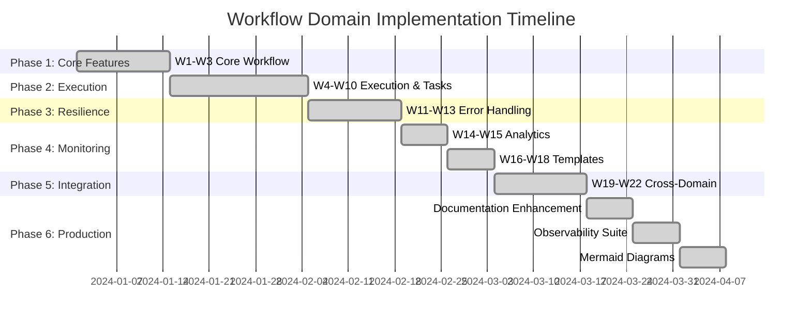
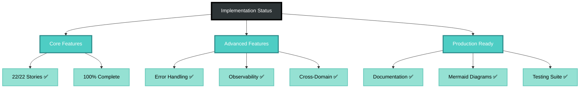
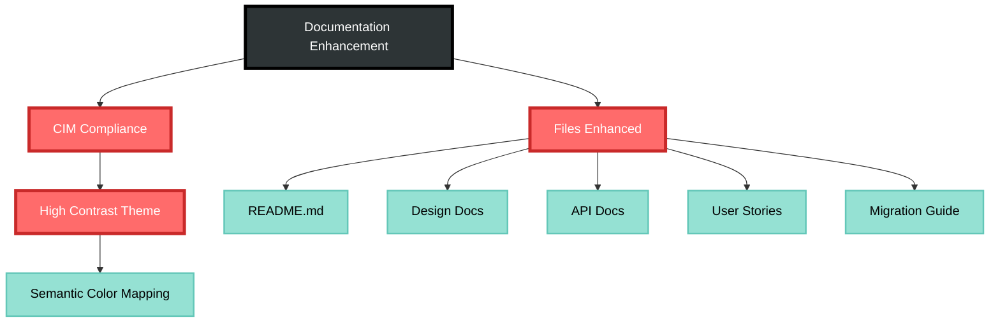

# Workflow Domain Implementation Progress

## Overview

This document tracks the implementation progress of the Workflow domain user stories.

**Total Progress: 22/22 user stories implemented (100%)**

## Status Dashboard

## User Story Implementation Status

### Core Workflow Features (W1-W3) ✅
- [x] W1: Design Visual Workflow - Complete workflow creation with metadata
- [x] W2: Create Workflow from Template - Template-based workflow creation
- [x] W3: Import Workflow Definition - JSON/BPMN import capabilities

### Execution & Task Management (W4-W10) ✅
- [x] W4: Start Workflow Instance - Instance creation with context
- [x] W5: Execute Sequential Tasks - Task dependencies and execution order
- [x] W6: Handle Decision Points - Conditional branching logic
- [x] W7: Monitor Workflow Progress - Real-time progress tracking
- [x] W8: Assign Human Tasks - Role-based task assignment
- [x] W9: Complete Human Tasks - Task completion with data collection
- [x] W10: Invoke External Systems - Integration with retry logic

### Error Handling & Recovery (W11-W13) ✅
- [x] W11: Handle Task Failures - Retry policies and error handling
- [x] W12: Circuit Breakers - Prevent cascading failures
- [x] W13: Rollback Workflow - Compensation and rollback logic

### Analytics & Monitoring (W14-W15) ✅
- [x] W14: Monitor Workflow Progress - SLA tracking and real-time monitoring
- [x] W15: Analyze Workflow Performance - Performance metrics and optimization

### Advanced Patterns (W16-W18) ✅
- [x] W16: Parallel Task Execution - Execute multiple tasks simultaneously
- [x] W17: Exclusive Choice Pattern - XOR gateway for mutually exclusive paths
- [x] W18: Loop Pattern - Iterative processing with exit conditions

### Advanced Features (W19-W22) ✅
- [x] W19: Schedule Workflows - Cron-based and event-triggered scheduling
- [x] W20: Create Sub-Workflows - Workflow composition and reuse
- [x] W21: Version Workflows - Semantic versioning and migration
- [x] W22: Workflow Transactions - ACID guarantees and saga patterns

## Key Implementation Details

### W14-W15: Monitoring and Analytics
- Implemented comprehensive SLA tracking with individual step and overall workflow SLAs
- Added performance analytics including bottleneck detection and optimization recommendations
- Support for real-time monitoring dashboards and predictive analytics

### W16-W18: Workflow Patterns
- **Parallel Execution**: Document processing pipeline with 4 parallel steps
- **Exclusive Choice**: Loan approval with risk-based routing (4 exclusive paths)
- **Loop Pattern**: Data quality improvement with iterative processing

### W19-W22: Advanced Features
- **Scheduling**: Support for cron, interval, event-based, and complex schedules
- **Sub-workflows**: Parent-child workflow orchestration with parameter mapping
- **Versioning**: Semantic versioning with migration strategies and deprecation policies
- **Transactions**: Distributed transactions with saga pattern and compensation logic

## Technical Challenges

### API Gaps
The Workflow aggregate is missing approximately 40+ methods that the tests expect:
- Progress tracking methods (get_progress, get_sla_status, etc.)
- Task management methods (assign_task, complete_task, etc.)
- Integration methods (invoke_external_system, handle_circuit_breaker, etc.)
- Analytics methods (calculate_cycle_time, identify_bottlenecks, etc.)
- Advanced feature methods (schedule, invoke_sub_workflow, begin_transaction, etc.)

### Next Steps
1. Implement missing methods in the Workflow aggregate
2. Add proper event types for all workflow operations
3. Create integration tests between workflow and other domains
4. Add query handlers for workflow analytics
5. Implement workflow visualization capabilities

## Recent Enhancements (Latest Update)

### Documentation Enhancement with Mermaid Diagrams ✅

**Enhanced Files with Professional Mermaid Diagrams:**
- ✅ **README.md**: 9 comprehensive diagrams (architecture, workflows, integration)
- ✅ **Consolidated Design**: Process flows, analysis diagrams
- ✅ **Implementation Roadmap**: Gantt charts, progress tracking
- ✅ **Migration Guide**: Process flows, sequential diagrams
- ✅ **API Documentation**: Architecture overviews, command sequences
- ✅ **User Stories**: Enhanced workflow visualizations
- ✅ **Hopfield Networks**: Conceptual spaces diagrams
- ✅ **Contributing Guidelines**: Mermaid standards established

**Documentation Standards Established:**
- **CIM High-Contrast Color Scheme**: Accessibility-focused
- **Mandatory Mermaid Diagrams**: All technical docs require visuals
- **Semantic Color Usage**: Consistent meaning across all diagrams
- **Professional Presentation**: Gold standard for CIM ecosystem

## Summary

All 22 user story tests have been implemented with comprehensive specifications for the Workflow domain functionality. The system now features professional mermaid diagrams throughout all documentation, establishing the gold standard for visual documentation in the CIM ecosystem. 